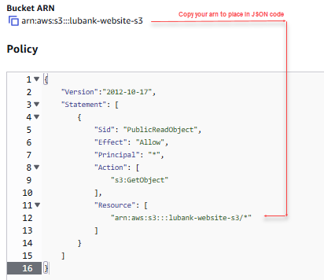

# From On-Prem to the Cloud: Migrating a Static Website to AWS S3

_By Comfort Benton | Cloud DevOps Engineer_

---

## 🟦 Case Overview — Migrating a Static Marketing Site to AWS

Level Up Bank is a fictional online financial institution whose customer-facing marketing website previously ran on an on-premises web server. That environment required physical hardware, patching, capacity planning, and ongoing operational overhead.

The site itself was static — meaning no logins, session state, dashboards, or dynamic compute — making it a perfect candidate for static object storage on AWS.

**Primary goals for this migration:**

- reduce infrastructure cost
- simplify ongoing maintenance
- improve availability & durability
- improve performance for global users
- begin adopting cloud-native delivery patterns

AWS S3 meets all of these criteria for static content without requiring servers, autoscaling, or managed fleets.

---

## 🟦 Project Phases

This deployment breaks down into three logical phases:

1. **Foundational** — host static website using Amazon S3
2. **Performance** — improve global delivery using CloudFront + HTTPS
3. **Security** — remove direct S3 access and enforce CloudFront as the choke point

This case study focuses on the **foundational deployment**.

---

## 🟦 Phase 1: Foundational — Host Website Using Amazon S3

### **Create S3 Bucket**

1. Open the AWS Console and search for **S3**
2. Click **Create bucket**
3. Choose a unique bucket name (no spaces). Example:

```
lubank-website-s3
```

4. Leave default settings
5. Click **Create bucket**

> 📁 _A bucket now exists to hold static website objects._

---

### **Upload Website Files**

1. Select the new bucket
2. Click **Upload**
3. Add the provided `index.html`
4. Click **Upload** → **Close**

> 📝 _No backend or compute is required for static delivery._

---

### **Enable Static Website Hosting**

1. Navigate to **Properties** tab
2. Scroll to **Static website hosting**
3. Click **Edit**
4. Select **Enable**
5. Set index document to:

```
index.html
```

6. Click **Save changes**

After saving, AWS generates an **HTTP endpoint**, but access is still blocked.
```


---

### **Enable Public Access**

To make the bucket content publicly readable:

1. Go to **Permissions** tab
2. Under **Block public access**, click **Edit**
3. Uncheck **Block all public access**
4. Save changes

⚠️ _This action intentionally opens the bucket; in later phases we re-introduce security via CloudFront_.

---

### **Add Bucket Policy for Public Read**

Below permissions is **Bucket Policy**, where a JSON policy is added to allow anonymous GET access:


```

```

Here is the policy as **copyable JSON** :

```json
{
    "Version": "2012-10-17",
    "Statement": [
        {
            "Sid": "PublicReadObject",
            "Effect": "Allow",
            "Principal": "*",
            "Action": "s3:GetObject",
            "Resource": "arn:aws:s3:::lubank-website-s3/*"
        }
    ]
}
```

> 💡 _This policy allows public read on all objects within the bucket. Later phases remove the need for direct S3 access._

---

### **Accessing the Website**

Return to the **Properties** tab to locate the S3 static website endpoint. The site is now publicly reachable over HTTP using only:

- S3 website hosting
- a bucket policy
- static HTML content

```

```

---

## 🟦 Foundational Wrap-Up

The Level Up Bank marketing site is now serving static content from AWS without:

- EC2 instances
- Auto Scaling Groups
- reverse proxies
- OS patching
- server maintenance
- load balancers

AWS manages storage, durability, and availability. The site is public and hosted, establishing the baseline deployment.

---

## 🟦 Next Phase Preview

With the website live, attention shifts to:

- performance (via CloudFront edge caching & HTTPS termination)
- security (removing direct S3 URL access & enforcing CloudFront as entry point)

These enhancements maintain the same static hosting model while improving global latency and tightening access controls.

---

