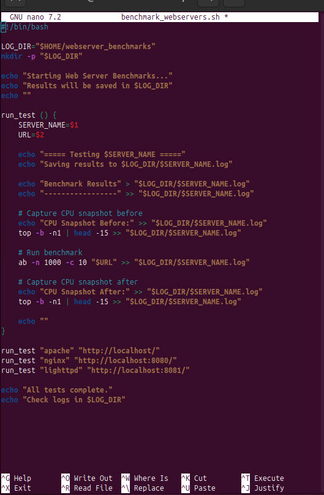
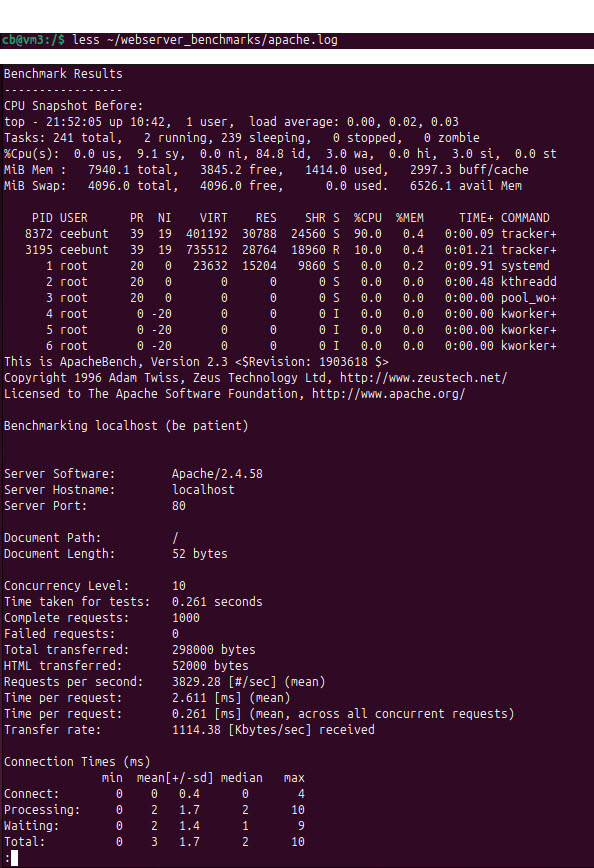
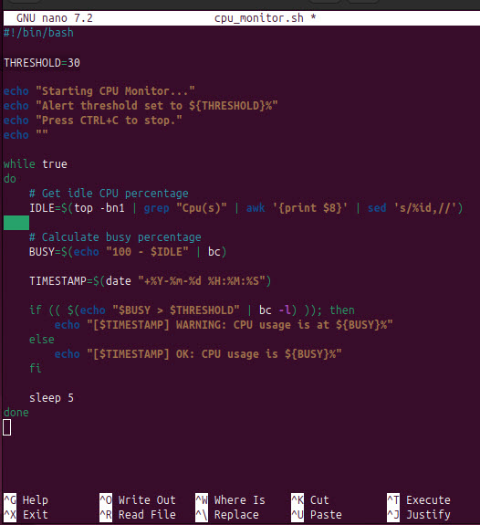
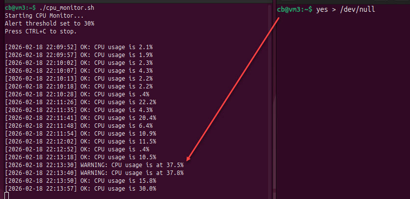
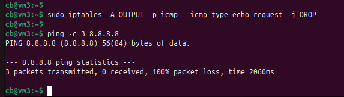
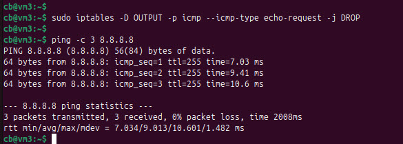

# Linux System Health  
## Performance, Monitoring, and Failure Simulation  
**By Comfort Benton | Cloud Engineer**

---

## Introduction

This week focused on real-world Linux system operations. Instead of learning isolated commands, the objective was to evaluate system performance, monitor resource usage, simulate failure scenarios, and troubleshoot network issues.

These exercises mirror operational responsibilities performed by cloud engineers, DevOps engineers, and Site Reliability Engineers (SREs) when maintaining production infrastructure.

The goal was not just to run commands, but to build engineering instincts:

- observe system behavior  
- capture evidence  
- simulate failure conditions  
- analyze performance  
- apply results to production thinking  

This project explored four core pillars of Linux system health:

- performance benchmarking  
- resource monitoring  
- storage reliability  
- network troubleshooting  

---

## 🎯 Learning Objectives

By the end of this project I was able to:

- benchmark web server performance  
- monitor CPU usage and trigger alerts  
- simulate filesystem capacity failures  
- troubleshoot network connectivity issues  
- automate system tasks using Bash  
- analyze system behavior using evidence  

---

## 🧪 Environment Setup

Before beginning the exercises, I prepared a Linux environment and installed the required tools.

### Environment

- Linux Distribution: Ubuntu 24.04 LTS (VirtualBox VM)  
- Purpose: controlled testing environment  

📸 **Environmental Setup**  


---

### Install Required Packages

```bash
sudo apt update
sudo apt install apache2 nginx lighttpd sysstat curl bc time quota e2fsprogs nmap
```

---

### Service Configuration

During setup, Apache was already using port 80, which caused NGINX and Lighttpd to fail due to port conflicts.

I reconfigured:

- NGINX → port 8080  
- Lighttpd → port 8081  

This allowed all services to run simultaneously for fair testing.

---

# 🧩 PROJECT BREAKDOWN

---

## 1️⃣ Web Server Stress Test & Performance Comparison

### Scenario

Choosing a web server based on preference alone can lead to poor performance decisions.  
To make an informed choice, I measured response times and CPU usage across multiple servers.  
The goal was to compare Apache, NGINX, and Lighttpd under identical conditions.

---

### What I Implemented

- installed and configured multiple web servers  
- created a shared test page  
- measured response time  
- ensured identical test conditions across all servers  
- monitored CPU usage  
- compared results  

---

### Create Test Page

```bash
echo "<h1>Hello Benchmark</h1>" | sudo tee /var/www/html/index.html
```

📸 **Shared Test Page Created**  


---

### Build Benchmark Script

Automation ensures tests are repeatable and consistent, which is essential for production performance evaluation.

I created a Bash script to automate performance testing and capture results.

```bash
nano benchmark_webservers.sh
```

📸 **Script Open in Nano**  


---

### Run Benchmark

```bash
chmod +x benchmark_webservers.sh
sudo ./benchmark_webservers.sh
```

📸 **chmod Command Success**  


📸 **Script Running Output**  


---

### Analyze Results

I also monitored system CPU usage during benchmarking using the `top` command to observe resource consumption under load.

Metrics evaluated:

- response time  
- requests per second  
- CPU usage  
- server behavior under load  

📸 **Benchmark Log Results**  


---

### Observations (Web Server Benchmarking)

- Under light load, all three servers delivered the same static page reliably with 0 failed requests.  
- Requests/sec: Apache: [3829.28], NGINX: [10759.05], Lighttpd: [17775.57]  
- Time/request (mean): Apache: [2.611], NGINX: [0.929], Lighttpd: [0.563]  
- CPU differences were small at this scale, which reinforced that configuration, workload type, and monitoring strategy matter more than raw speed for simple static pages.  

---

### What this means in the real world

When traffic is low, server choice may not matter as much as operational readiness: logging, monitoring, tuning, and scaling strategy. Benchmarking gives evidence to support decisions instead of relying solely on preference.

---

### Real-World Connection

This mirrors production service benchmarking, capacity planning, and infrastructure optimization in cloud environments.

---

## 2️⃣ Detecting CPU Overuse and Alerting via Script

### Scenario

High CPU usage can degrade performance or cause service failures.

The goal was to build a lightweight monitoring system that detects abnormal resource usage and alerts when CPU consumption exceeds a defined threshold. I temporarily used a 30% threshold to validate alert behavior more quickly.

---

### What I Implemented

- designed and implemented a CPU monitoring script  
- parsed CPU idle percentage from top and calculated CPU busy usage  
- calculated CPU busy percentage  
- implemented threshold-based alert logic  
- simulated CPU load to validate monitoring behavior  

---

### Create Monitoring Script

```bash
nano cpu_monitor.sh
```

📸 **CPU Script in Editor**  


---

### Run Monitor

```bash
chmod +x cpu_monitor.sh
./cpu_monitor.sh
```

In a second terminal I initiated a CPU spike test:

```bash
yes > /dev/null
```

The load test was stopped using CTRL+C after validation.

📸 **CPU Monitor Alert Triggered**  


---

### Observations

- CPU usage increased when load was simulated using yes > /dev/null.  
- The script continuously monitored system usage every 5 seconds.  
- When CPU usage exceeded the defined threshold, warning messages were triggered.  
- After stopping the load, CPU usage returned to normal levels.  
- This demonstrates proactive monitoring and early detection of resource issues.  

---

### Real-World Connection

This replicates automated monitoring and alerting systems used in production infrastructure and cloud environments, such as AWS CloudWatch, Prometheus, or Datadog.

---

## 3️⃣ Filesystem Health & Quota Simulation

### Scenario

Storage failures can occur even when disk space appears available. This type of failure can cause system instability or service interruptions.

The goal was to simulate inode storage exhaustion and configure filesystem quotas to understand how Linux manages limited resources.

---

### What I Implemented

- created a loopback disk image for safe testing  
- formatted filesystem with limited inode count  
- mounted filesystem with quota support  
- enabled user and group quotas  
- configured storage limits for a test user  
- generated large numbers of files to simulate storage failure  
- observed system behavior when limits were reached  

---

### Create Loopback Filesystem

Commands used:

```bash
fallocate
mkfs.ext4
mount
```

📸 **Loopback Disk Created**  


---

### Configure Quotas

📸 **Inode Baseline**  


📸 **Quotas Enabled**  


---

### Simulate Storage Failure / Exhaustion

📸 **Inode Exhaustion Error**  


---

### Observations

- The system allowed creation of files until inode limits were exhausted.  
- Once the inode limit was reached, the system returned “No space left on device”, even though disk space remained available.  
- This demonstrates that storage failure can occur due to file count limits, not only disk size usage.  
- Quota configuration successfully restricted resource usage and prevented uncontrolled file creation.  
- The test illustrates how Linux protects system stability by enforcing resource limits.  

---

### Real-World Connection

This simulation mirrors production storage management in cloud environments such as AWS EBS or EFS.

---

## 4️⃣ Network Troubleshooting & Connectivity Testing

### Scenario

Network connectivity failures can result from misconfigurations, firewall rules, or blocked protocols.

The goal was to simulate network failure conditions, test connectivity across different layers, and verify service availability during disruptions.

---

### What I Implemented

- verified baseline network connectivity  
- tested DNS resolution and external connectivity  
- simulated network failure by blocking outbound ICMP traffic  
- tested service reachability during failure conditions  
- restored connectivity after testing  

---

### Check Network Baseline

```bash
ip a
ping -c 3 google.com
getent hosts google.com
```

📸 **Network Baseline**  


---

### Simulate Network Failure

```bash
sudo iptables -A OUTPUT -p icmp --icmp-type echo-request -j DROP
ping -c 3 8.8.8.8
```

📸 **Ping Failure After Firewall Rule**  


---

### Verify Service Reachability

```bash
curl -I https://google.com
```

📸 **Service Reachable Despite Ping Failure**  


---

### Restore Network Connectivity

```bash
sudo iptables -D OUTPUT -p icmp --icmp-type echo-request -j DROP
ping -c 3 8.8.8.8
```

📸 **Connectivity Restored**  


---

### Observations

- Network connectivity was initially verified through IP configuration and successful ping tests.  
- Blocking outbound ICMP traffic caused ping requests to fail while other network services remained accessible.  
- Service testing confirmed that network functionality can persist even when certain protocols are restricted.  
- Removing the firewall rule restored normal connectivity.  
- This demonstrates the importance of systematic troubleshooting across different network layers.  

---

### Real-World Connection

This exercise mirrors production network troubleshooting and incident response workflows.

---

## 💡 Key Takeaways

- Linux systems require continuous monitoring to maintain stability.  
- Performance testing informs infrastructure and scaling decisions.  
- Storage limits and inode exhaustion can cause unexpected failures.  
- Automated alerts improve system reliability and response time.  
- Structured network troubleshooting reduces downtime and speeds incident resolution.  

---

## 🚀 Reflection — Comfort in the Cloud

This week strengthened my understanding of system observability and infrastructure reliability.

The exercises helped me think like an operations engineer by testing performance, monitoring system health, simulating storage failures, and troubleshooting network issues.

These skills translate directly to cloud engineering, where system performance, monitoring, and reliability determine service availability and user experience.
