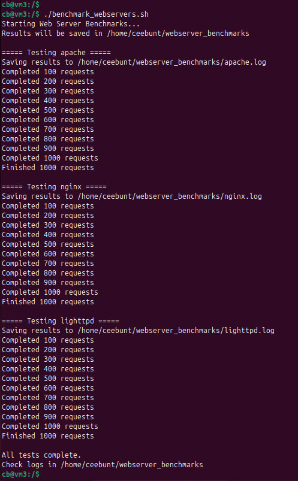

# Linux System Health — Performance, Monitoring, and Failure Simulation

This project demonstrates real-world Linux system operations including performance benchmarking, CPU monitoring automation, filesystem failure simulation, and network troubleshooting.

These exercises mirror operational responsibilities performed by cloud engineers, DevOps engineers, and Site Reliability Engineers (SREs) when maintaining production infrastructure.

---

## 🎯 Project Goals

The goal was not just to run commands, but to build engineering instincts:

- observe system behavior
- capture evidence
- simulate failure conditions
- analyze performance
- apply results to production thinking

This project explores four core pillars of Linux system health:

- performance benchmarking
- resource monitoring
- storage reliability
- network troubleshooting

---

## 🧠 Learning Objectives

By completing this project I was able to:

- benchmark web server performance
- monitor CPU usage and trigger alerts
- simulate filesystem capacity failures
- troubleshoot network connectivity issues
- automate system tasks using Bash
- analyze system behavior using evidence

---

# 🖥️ Environment Setup

## Environment

- **OS:** Ubuntu 24.04 LTS (VirtualBox VM)
- **Purpose:** Controlled testing environment

📸 **Environmental Setup**
```markdown

```

Service Configuration & Shared Test Page

📸 Shared Test Page Created


🚀 Project Breakdown
1️⃣ Web Server Stress Test & Performance Comparison
Script Creation

📸 Script Open in Nano


Script Execution
📸 chmod Command Success


📸 Script Running Output


Benchmark Log Results
📸 Log Contents


Observations
* All servers delivered static content reliably with 0 failed requests.
* Performance differences were small at low load.
* Monitoring and configuration matter more than raw speed.


