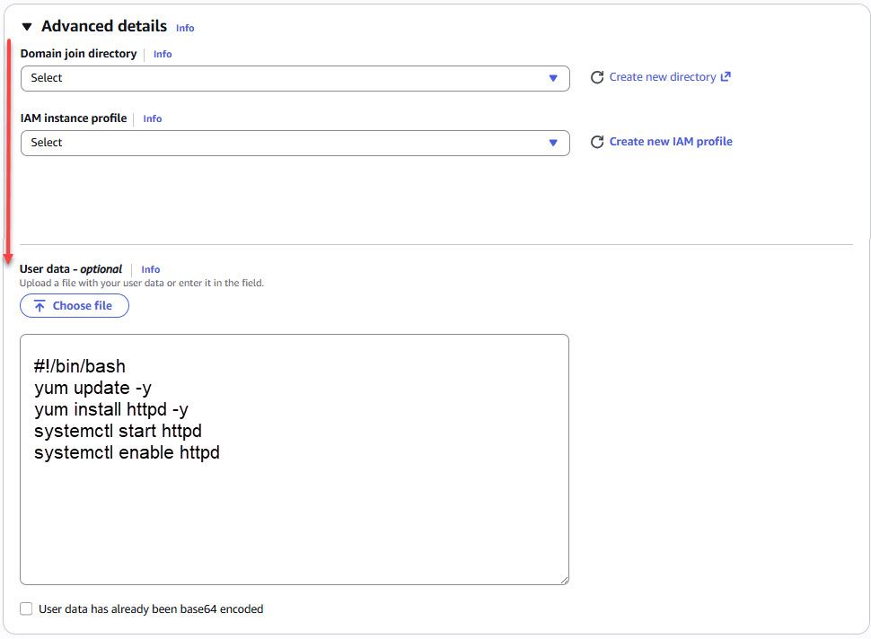
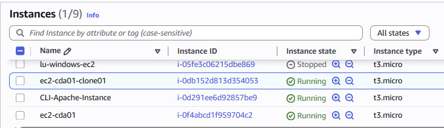
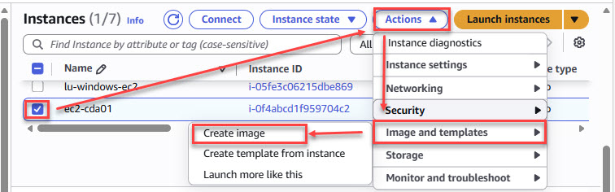
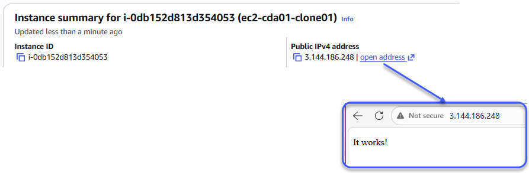
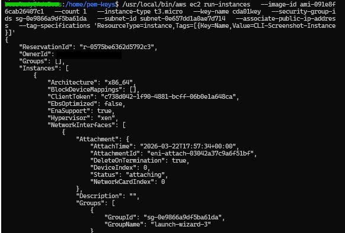
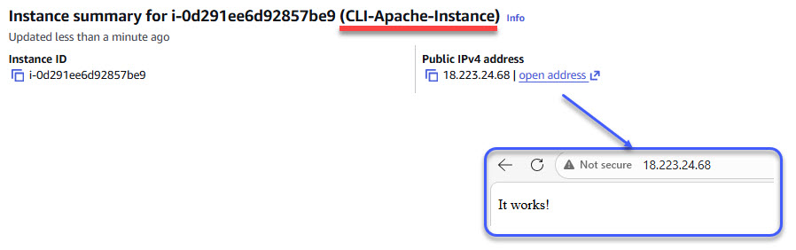
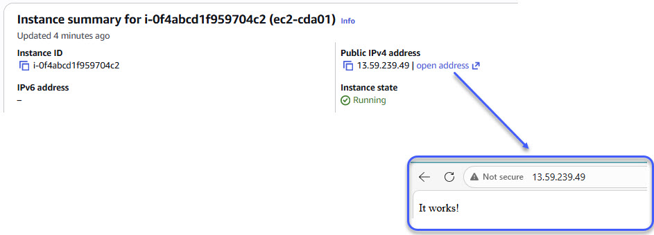

# ☁️ EC2 Apache Deployment with User Data, AMI, and AWS CLI

## 🎯 Project Overview

This project demonstrates how to deploy and manage an EC2-based web server in AWS using three approaches:

* **User Data automation**
* **Amazon Machine Image (AMI) reuse**
* **AWS CLI provisioning**

The goal was to simulate a real-world scenario where infrastructure is automated, repeatable, and scalable.

---

## 🧠 Key Concepts

* Amazon EC2 (compute service)
* User Data (automated instance configuration)
* Public IP access
* AMI (reusable server template)
* AWS CLI (infrastructure provisioning)

---

# 🏗️ Phase 1 — EC2 + User Data

## 🎯 Goal

Launch an EC2 instance that automatically installs and runs Apache using a user data script.

---

## ⚙️ User Data Script

```bash
#!/bin/bash
yum update -y
yum install httpd -y
systemctl start httpd
systemctl enable httpd
```

---

## 🖼️ Configuration (User Data Applied)



---

## ✅ Result

* EC2 instance launched successfully
* Apache installed automatically
* Web server accessible via public IP

---

## 🌐 Verification



---

## 🧠 What I Learned

User data is a script that runs at instance launch, allowing automation of setup tasks such as installing software and starting services.

This eliminates manual configuration and ensures consistency across deployments.

---

# 🚀 Phase 2 — AMI Creation & Reuse

## 🎯 Goal

Create a reusable image from a configured EC2 instance and launch a new instance from it.

---

## 🖼️ Creating the AMI



---

## 🧠 Concept

An AMI allows you to:

> Build once and deploy many times with the same configuration.

---

## 🖼️ Launching from AMI



---

## ✅ Result

* New EC2 instance launched from AMI
* Apache already installed (no user data needed)
* Verified via browser

---

## 🌐 Verification


---

## 🧠 What I Learned

AMI creation allows rapid, consistent deployment of pre-configured environments without repeating setup steps.

---

# 🔥 Phase 3 — AWS CLI Deployment

## 🎯 Goal

Launch an EC2 instance using the AWS CLI instead of the console.

---

## 💻 CLI Command Used

```bash
/usr/local/bin/aws ec2 run-instances \
  --image-id ami-091e8f6cab26407c1 \
  --count 1 \
  --instance-type t3.micro \
  --key-name cda01key \
  --security-group-ids sg-0e9866a9df5ba61da \
  --subnet-id subnet-0e657dd1a0ae7d714 \
  --associate-public-ip-address \
  --tag-specifications 'ResourceType=instance,Tags=[{Key=Name,Value=CLI-Apache-Instance}]'
```

---

## 🖼️ CLI Execution Output



---

## 🖼️ CLI Instance Verification



---

## ✅ Result

* EC2 instance successfully launched via CLI
* Instance configured using existing AMI
* Apache verified via public IP

---

## 🧠 What I Learned

Using the AWS CLI enables:

* automation
* repeatability
* infrastructure provisioning without the console

This reflects real-world cloud engineering workflows.

---

# ⚠️ Challenges & Resolutions

| Challenge                                          | Resolution                                 |
| -------------------------------------------------- | ------------------------------------------ |
| AWS CLI not installed properly                     | Installed using official AWS CLI installer |
| Credentials error ("Unable to locate credentials") | Used `aws login` and configured region     |
| Instance type not eligible                         | Switched from `t2.micro` to `t3.micro`     |
| Browser not opening during login                   | Manually copied login URL                  |

---

# 🖼️ EC2 Dashboard Overview



---

# 🎯 Final Takeaways

This project reinforced key cloud engineering concepts:

* Automating server setup using user data
* Creating reusable infrastructure with AMIs
* Provisioning resources programmatically using AWS CLI
* Verifying deployments through both CLI and browser

---

# 🚀 Summary

This project demonstrates a transition from:

➡️ Manual setup
➡️ To automated, repeatable infrastructure

It highlights the importance of automation, consistency, and efficiency in cloud environments.

---
