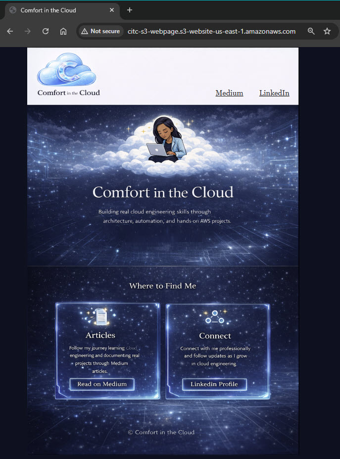

# 🌐 Phase 1: AWS Deployment (S3 Static Website)

## 🎯 Project Goal
Deploy a static website to AWS using Amazon S3 after validating the site locally.

---

## 🧠 Context

After confirming that the website functioned correctly in my local environment, I proceeded to deploy it to AWS using Amazon S3 for static website hosting.

Rather than repeating the full step-by-step process, this phase builds on a previous project where I implemented and documented the complete S3 static website setup.

👉 For detailed deployment steps (foundational), see:
[Static Website Setup Guide](../20260118-S3-Static-Site/20260118-S3-Static-Site-Article.md)

---

## ⚙️ What Was Completed

- Created an S3 bucket for website hosting  
- Enabled static website hosting on the bucket  
- Uploaded website files (HTML, CSS, assets)  
- Configured public access settings  
- Validated live site functionality via S3 endpoint  

---

## ✅ Outcome

- Successfully deployed a live static website using Amazon S3  
- Confirmed public accessibility of the site  
- Established a working foundation for future enhancements (monitoring, automation, etc.)

---

## 🧠 Key Takeaways

- S3 provides a simple and cost-effective way to host static websites  
- Proper public access configuration is required for accessibility  
- Validating locally before deployment helps reduce troubleshooting time  

---

## 📸 Live Site Validation

Successfully launched the **Comfort in the Cloud** static website using Amazon S3.

