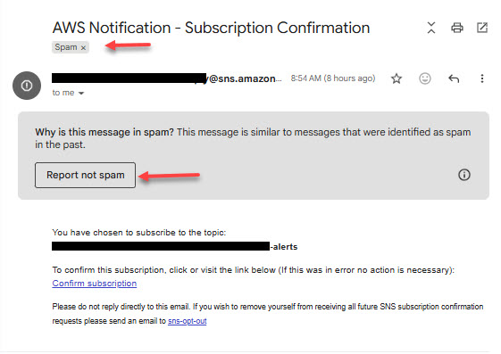
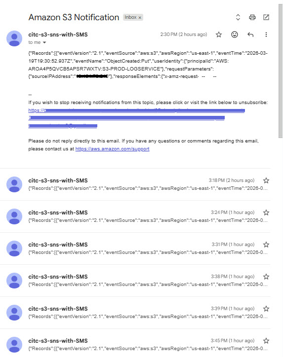

# 📬 Phase 2: S3 Event Alerts with SNS (Static Website Monitoring)

## 🎯 Project Goal
Set up simple email notifications when changes are made to an Amazon S3 bucket hosting a static website.

The goal was to create a lightweight alerting mechanism without introducing unnecessary complexity.
 
---

## 🧠 What I Learned
- Amazon S3 can trigger events directly to SNS
- SNS email subscriptions require **manual confirmation**
- Email delivery success does NOT guarantee inbox visibility (spam filtering matters)
- Troubleshooting cloud systems requires validating each layer before adding complexity

---

## 🏗️ Architecture

User Action → S3 Bucket Event → SNS Topic → Email Notification

---

## ⚙️ Services Used
- Amazon S3 (Static Website Hosting)
- Amazon SNS (Simple Notification Service)
- Email (Endpoint for notifications)

---

## 🔧 Implementation Steps

### 1. Created SNS Topic
- Type: Standard
- Name: `citc-s3-alerts`

### 2. Subscribed Email Endpoint
- Protocol: Email
- Endpoint: Personal email address
- Confirmed subscription via email link

⚠️ *Important:* The confirmation email was initially missed because it was routed to the spam folder.

---

### 3. Configured S3 Event Notification
- Event Type: `All object create events`
- Destination: SNS Topic (`citc-s3-alerts`)

---

### 4. Tested the Workflow
- Uploaded a file to the S3 bucket
- Expected result: Email notification triggered via SNS

---

## 🚧 Challenge Encountered

### Issue:
I initially believed the S3 → SNS → Email setup was not working because I did not receive any emails. I briefly thought of introducing the Lambda function, but continued to research and discovered the issue.

### Root Cause:
- SNS emails were being delivered to the **spam folder**
- Subscription confirmation email was also missed for the same reason

---

## 🔄 Adjustment Made

After identifying that emails were going to spam:

- Confirmed SNS subscription successfully
- Marked SNS emails as "Not Spam"
- Re-tested the workflow

---

## 📸 Successful S3 Notification

After confirming the subscription and resolving the email visibility issue, S3 event notifications were successfully delivered via SNS.

---

## 🧠 Key Takeaways

- Always validate **delivery vs visibility**
- Check spam/junk folders during email-based integrations
- Avoid adding services (like Lambda) until the root cause is confirmed
- Simpler architectures are easier to maintain and explain

---

## 🚀 Next Steps

- Validate consistent email delivery from SNS
- Explore filtering specific S3 event types (e.g., only `.html` updates)
- Optionally enhance alerts using Lambda for:
  - Message formatting
  - Conditional filtering
  - Multi-channel notifications

---

## 💬 Reflection

This project reinforced the importance of slowing down during troubleshooting.

What appeared to be a system failure was actually a visibility issue. Once identified, I was able to simplify the architecture and align it with the original design goal.

---
