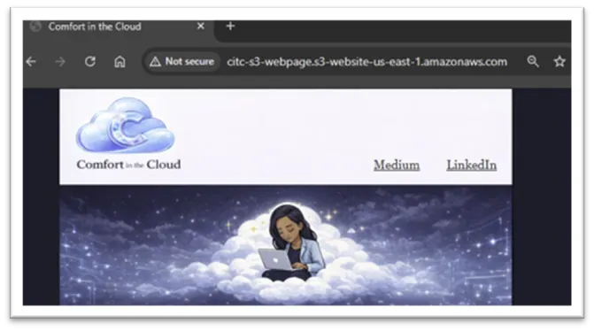
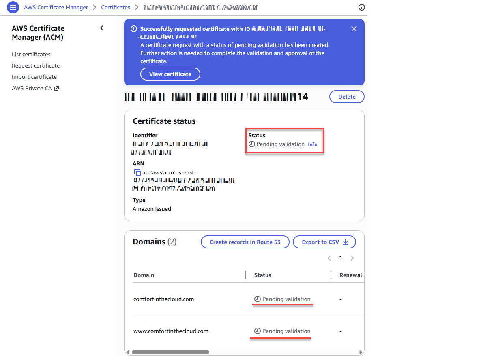
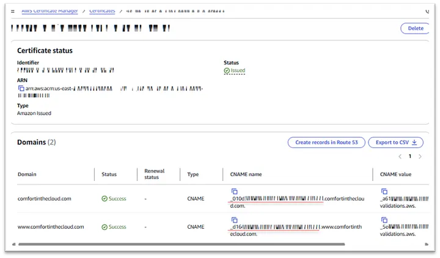
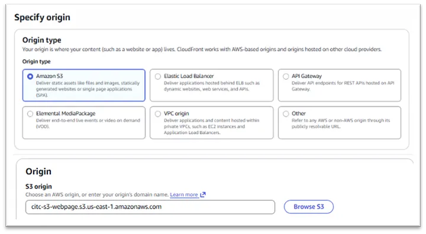
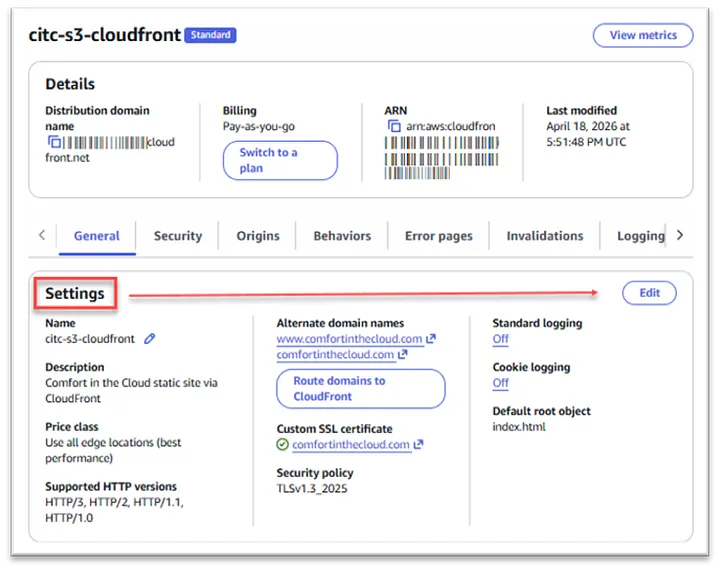
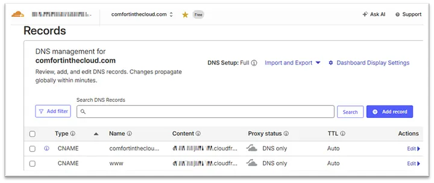
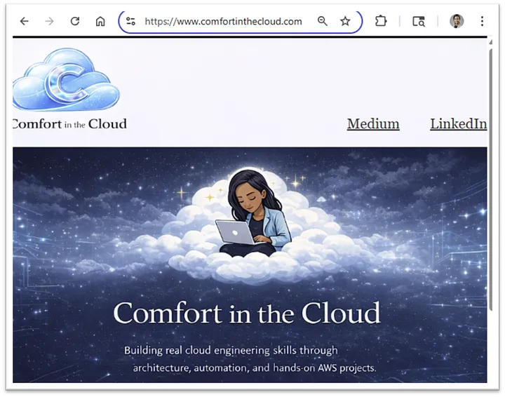

# ☁️ Phase 4: CloudFront Integration & Secure Delivery

## 📌 Project Goal

The goal of this phase was to transform an existing Amazon S3 static website into a more secure and production-style web architecture using:

- Amazon CloudFront
- AWS Certificate Manager (ACM)
- Cloudflare DNS
- HTTPS encryption
- Custom domain integration

This phase focused heavily on secure delivery, DNS routing, and understanding how CloudFront behaves behind the scenes.

---

# 🧠 What I Learned

During this phase, I learned:

- How CloudFront distributions work
- Why ACM certificates for CloudFront must be created in `us-east-1`
- How DNS validation works with Cloudflare
- The difference between S3 website endpoints vs S3 bucket origins
- How HTTPS is attached to CloudFront
- Why some important CloudFront settings are hidden until after distribution creation
- How Cloudflare DNS can successfully work with AWS services

---

# 🏗️ Architecture Overview

```text
Visitors
   ↓
Cloudflare DNS
   ↓
Amazon CloudFront (HTTPS)
   ↓
Amazon S3 Static Website
```

---

# 🛠️ Services Used

| Service | Purpose |
|---|---|
| Amazon S3 | Static website hosting |
| Amazon CloudFront | Secure global content delivery |
| AWS Certificate Manager | SSL/TLS certificate management |
| Cloudflare DNS | Domain management and DNS routing |

---

# 🚀 Step 1: Verify Existing S3 Website

Before introducing CloudFront, I first confirmed that the website was already functioning properly through the S3 endpoint.

### Tasks Completed

- Verified static website hosting was enabled
- Confirmed `index.html` was loading correctly
- Tested website accessibility through the S3 website endpoint

---

## 📸 Suggested Screenshot

```markdown

```

---

# 🔐 Step 2: Request an SSL Certificate in ACM

To enable HTTPS through CloudFront, I requested a public SSL/TLS certificate using AWS Certificate Manager.

---

## ⚠️ Important Discovery

For CloudFront distributions, ACM certificates must be requested in:

```text
N. Virginia (us-east-1)
```

Even if the rest of your resources are elsewhere.

---

## Tasks Completed

- Opened AWS Certificate Manager
- Requested a public certificate
- Added:
  - `comfortinthecloud.com`
  - `www.comfortinthecloud.com`
- Chose DNS validation

---

# 🌐 Step 3: Validate Domain Ownership Through Cloudflare

Because my domain was purchased and managed through Cloudflare instead of Route 53, I had to manually validate the ACM certificate.

AWS generated CNAME records that needed to be added into Cloudflare DNS.

---

## Tasks Completed

- Copied ACM validation CNAME records
- Opened Cloudflare DNS management
- Created validation CNAME records
- Waited for ACM validation
- Confirmed certificate status changed to:

```text
Issued
```

---

## 📸 Suggested Screenshots

```markdown



```

---

# ☁️ Step 4: Create the CloudFront Distribution

This was the most educational part of the project.

Initially, I expected CloudFront setup to be straightforward, but I quickly discovered that some important configuration settings were not immediately visible during the first setup flow.

---

# 💡 Free vs Pay-As-You-Go Discovery

During setup, AWS presented both:

- Free option
- Pay-as-you-go option

At first, the free option seemed ideal.

However, I learned that the pay-as-you-go configuration exposed the options I needed for:

- custom domain integration
- SSL certificate attachment
- advanced CloudFront configuration

---

## 💵 Cost Insight

Although this setup was not technically free, the actual cost for a low-traffic personal site is typically very small.

Because CloudFront pricing is usage-based, the real-world cost for projects like this is often minimal.

---

# ⚠️ Important Origin Discovery

When selecting the origin, I learned that CloudFront should point directly to:

✅ The S3 bucket origin

NOT:

❌ The S3 static website endpoint

This distinction matters for proper CloudFront integration and security behavior.

---

# 🧩 Missing Settings Discovery

One confusing moment during setup was realizing that I could not initially find where to:

- attach the SSL certificate
- configure the custom domain

At first, it appeared those options were missing entirely.

---

# ✅ Solution

The solution was:

1. Create the distribution first
2. Open the CloudFront distribution afterward
3. Edit the distribution settings

Once inside the settings page, the missing configuration options became available.

---

# ⚙️ Final CloudFront Configuration

After editing the distribution, I configured:

- Alternate domain names:
  - `comfortinthecloud.com`
  - `www.comfortinthecloud.com`
- Attached ACM certificate
- Enabled HTTPS delivery
- Configured default root object:
  - `index.html`

---

## 📸 Suggested Screenshots

```markdown



```

---

# 🌍 Step 5: Connect Cloudflare DNS to CloudFront

Once CloudFront deployment completed, I updated Cloudflare DNS records to route traffic through CloudFront.

---

## Tasks Completed

Created DNS records for:

- Root domain (`@`)
- `www`

Both records pointed to the CloudFront distribution domain.

---

# ⚠️ Important Cloudflare Setting

During setup, I intentionally kept the records as:

```text
DNS Only (Grey Cloud)
```

This helped avoid SSL and proxy complications while validating the CloudFront setup.

---

## 📸 Suggested Screenshot

```markdown

```

---

# ✅ Step 6: Validate Final HTTPS Website

After DNS propagation completed, I tested the website through the custom domain.

---

## Validation Checklist

- HTTPS certificate valid
- Site loads correctly
- CloudFront distribution active
- Images load properly
- Navigation works
- Desktop layout correct
- Mobile layout correct

---

# 🎉 Final Result

The final result was:

✅ A secure HTTPS website  
✅ Delivered globally through CloudFront  
✅ Connected to a custom domain through Cloudflare  
✅ Backed by Amazon S3 static hosting  

---

## 📸 Suggested Screenshot

```markdown

```

---

# 🧠 Key Lessons Learned

This phase taught me several important real-world cloud concepts:

- CloudFront setup is not always intuitive
- Some AWS configuration options appear only after resource creation
- ACM validation is manual outside Route 53
- Cloudflare integrates cleanly with AWS services
- HTTPS and CDN delivery significantly improve website professionalism
- Real architecture work often involves adapting plans instead of forcing the original design

---

# 🔥 Biggest Takeaway

This phase moved the project beyond simple static hosting and into a more realistic cloud architecture.

Instead of simply deploying files to S3, I learned how secure delivery, DNS management, SSL certificates, and CDN behavior all work together in a real public-facing environment.

---

# 📂 Related Project Files

```text
assets/
├── s3-static-site.png
├── acm-request.png
├── acm-issued.png
├── cloudfront-origin.png
├── cloudfront-settings.png
├── cloudflare-dns.png
└── live-https-site.png
```

---

# 🔗 Next Phase

➡️ [Phase 5 - Monitoring, Alerts & Architecture Visibility](05.Phase5.md)
