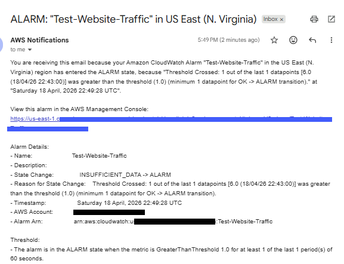

# 📊 Phase 5: Monitoring, Alerts & Architecture Visibility

## 📌 Project Goal

The goal of this phase was to introduce observability into the project by adding:

- CloudWatch monitoring
- dashboard visibility
- traffic metrics
- error tracking
- CloudWatch alarms
- SNS email notifications

This phase focused on moving beyond simply deploying infrastructure and into understanding how the system behaves in real time.

---

# 🧠 What I Learned

During this phase, I learned:

- how CloudWatch metrics work
- how CloudFront publishes monitoring data
- how to build custom CloudWatch dashboards
- how to separate traffic metrics from error metrics
- how CloudWatch alarms evaluate thresholds
- how SNS integrates with CloudWatch for notifications
- how observability improves operational awareness

---

# 🏗️ Architecture Overview

```text
Visitors
   ↓
Cloudflare DNS
   ↓
Amazon CloudFront
   ↓
Amazon S3 Static Website
   ↓
Amazon CloudWatch Metrics
   ↓
CloudWatch Alarms
   ↓
Amazon SNS Email Notifications
```

---

# 🛠️ Services Used

| Service | Purpose |
|---|---|
| Amazon CloudWatch | Monitoring and metrics |
| Amazon SNS | Email notifications |
| Amazon CloudFront | Traffic and error metrics source |
| Amazon S3 | Website hosting origin |

---

# 🚀 Step 1: Explore CloudWatch Metrics

After successfully deploying the website through CloudFront, I wanted visibility into how the system was behaving behind the scenes.

I started by exploring CloudWatch metrics.

---

## Navigation Path

```text
CloudWatch → Metrics → All Metrics → CloudFront
```

From there, I selected:

```text
Per-Distribution Metrics
```

This allowed me to monitor metrics specific to my CloudFront distribution.

---

# 📈 Step 2: Select Key CloudFront Metrics

I focused on metrics that would provide meaningful visibility into both traffic and site health.

---

## Metrics Selected

### Traffic Metrics
- Requests
- BytesDownloaded

### Error Metrics
- 4xxErrorRate
- 5xxErrorRate

---

# 💡 Why These Metrics Matter

| Metric | Purpose |
|---|---|
| Requests | Shows visitor activity |
| BytesDownloaded | Shows content delivery volume |
| 4xxErrorRate | Shows client-side errors |
| 5xxErrorRate | Shows server-side or backend issues |

---

# 🧩 Step 3: Build a CloudWatch Dashboard

Instead of leaving the metrics scattered individually inside CloudWatch, I created a custom dashboard to organize and visualize the data more clearly.

---

# 📊 Dashboard Design

I intentionally separated the dashboard into two focused widgets.

---

## Widget 1: Website Traffic (CloudFront)

This widget focused on general site usage and delivery activity.

### Metrics Included
- Requests
- BytesDownloaded

### Purpose
This allowed me to quickly see:

- whether traffic was reaching the site
- whether content was actively being delivered
- how CloudFront activity changed over time

---

## Widget 2: Error Rates (CloudFront)

This widget focused on identifying problems and failed requests.

### Metrics Included
- 4xxErrorRate
- 5xxErrorRate

### Purpose
This helped surface:

- broken links
- invalid requests
- backend issues
- potential delivery problems

---

# 🎨 Dashboard Visibility Improvements

Separating traffic and error metrics into different widgets made the dashboard:

- easier to read
- easier to troubleshoot
- more operationally useful

This was one of the first moments where the project started feeling less like a lab and more like a real environment.

---

# 🚨 Step 4: Create a CloudWatch Alarm

Once the dashboard was complete, I wanted to test real alerting behavior.

To do this, I created a CloudWatch alarm tied to website traffic.

---

# ⚠️ Alarm Strategy for a Low-Traffic Site

Because this was a personal portfolio website with minimal traffic, I intentionally used a very small threshold so I could validate the alerting pipeline quickly.

---

## Alarm Configuration

| Setting | Value |
|---|---|
| Metric | Requests |
| Condition | Greater than or equal to 1 |
| Evaluation Period | 1 minute |
| Datapoints to Alarm | 1 |

---

# 🧠 Why This Was Useful

Using a low threshold allowed me to:

- trigger the alarm intentionally
- validate SNS integration
- confirm CloudWatch alarm behavior
- test end-to-end notifications

In a larger production environment, thresholds would typically be set much higher.

---

# 📬 Step 5: Configure SNS Email Notifications

To receive notifications from the alarm, I configured Amazon SNS.

---

## Tasks Completed

- Created SNS topic
- Subscribed email endpoint
- Confirmed email subscription
- Connected CloudWatch alarm to SNS topic

---

# 🔄 Alert Flow

```text
CloudWatch Metric
   ↓
CloudWatch Alarm
   ↓
SNS Topic
   ↓
Email Notification
```

---

# 🧪 Step 6: Validate End-to-End Alerting

To test the alert:

1. Opened the website
2. Refreshed the site multiple times
3. Waited for CloudWatch evaluation
4. Monitored email inbox

---

# ✅ Successful Result

The alarm successfully transitioned into:

```text
ALARM
```

And I received the SNS notification email confirming:

- metric evaluation worked
- alarm threshold triggered correctly
- SNS delivery succeeded
- monitoring pipeline functioned end to end

---

## 📸 Suggested Screenshot

```markdown

```

---

# ⚠️ Understanding Error Rates

One important learning moment during this phase was understanding the difference between:

- 4xx errors
- 5xx errors

---

## 4xx Errors

These are typically client-side issues such as:

- broken links
- invalid URLs
- forbidden requests

Example:

```text
404 Not Found
```

---

## 5xx Errors

These are server-side or backend problems such as:

- origin failures
- delivery failures
- application problems

Example:

```text
500 Internal Server Error
```

---

# 💡 Operational Insight

This phase helped me understand that observability is not just about seeing graphs.

It is about understanding:

- whether users can access the site
- whether content is delivering correctly
- whether failures are occurring
- whether alerts are actionable

---

# 🧹 Logging & Cleanup Discovery

During testing, I discovered that my separate S3 logs bucket was accumulating thousands of small log objects.

This became another important operational learning moment.

---

# 🔍 What I Learned About Logging

I confirmed:

- SNS itself does not store logs in S3 by default
- CloudFront logging and S3 access logging are separate concepts
- logging can continue generating objects if not intentionally disabled
- log management matters for both organization and cost awareness

---

# ✅ Cleanup Actions Taken

- Reviewed CloudFront logging settings
- Verified CloudFront standard logging was disabled
- Investigated S3 log bucket activity
- Identified unnecessary accumulated log objects
- Cleaned up log storage after testing

---

# 🧠 Biggest Takeaway

This phase completely changed how I viewed cloud infrastructure.

Before this phase, I focused mostly on building resources.

After this phase, I started thinking about:

- visibility
- monitoring
- operational awareness
- alerting
- troubleshooting
- system behavior

This was one of the first times the project truly started feeling like a real cloud environment.

---

# 🔥 Key Lessons Learned

- CloudWatch metrics become much more useful when organized intentionally
- Traffic metrics and error metrics tell different stories
- Alarm thresholds should match the scale of the environment
- SNS provides a clean way to deliver alerts
- Observability is a major part of cloud engineering
- Monitoring systems also require cleanup and management

---

# 📂 Related Project Files

```text
assets/
├── cloudwatch-dashboard.png
├── cloudwatch-traffic-widget.png
├── cloudwatch-error-widget.png
├── cloudwatch-alarm-config.png
├── cloudwatch-alarm-email.png
└── monitoring-architecture.png
```

---

# 🎯 Final Outcome

By the end of this phase, I successfully implemented:

✅ CloudWatch dashboard visibility  
✅ CloudFront traffic monitoring  
✅ Error rate monitoring  
✅ CloudWatch alarm testing  
✅ SNS email notifications  
✅ End-to-end alert validation  
✅ Operational monitoring awareness  

---

# 🚀 Future Improvements

Potential future monitoring improvements include:

- adding 5xx production-style alarms
- configuring automatic log lifecycle policies
- expanding dashboard metrics
- introducing centralized logging workflows
- creating long-term monitoring retention strategies

---

# 🔗 Related Phases

➡️ [Phase 4 - CloudFront Integration & Secure Delivery](04.Phase4.md)
