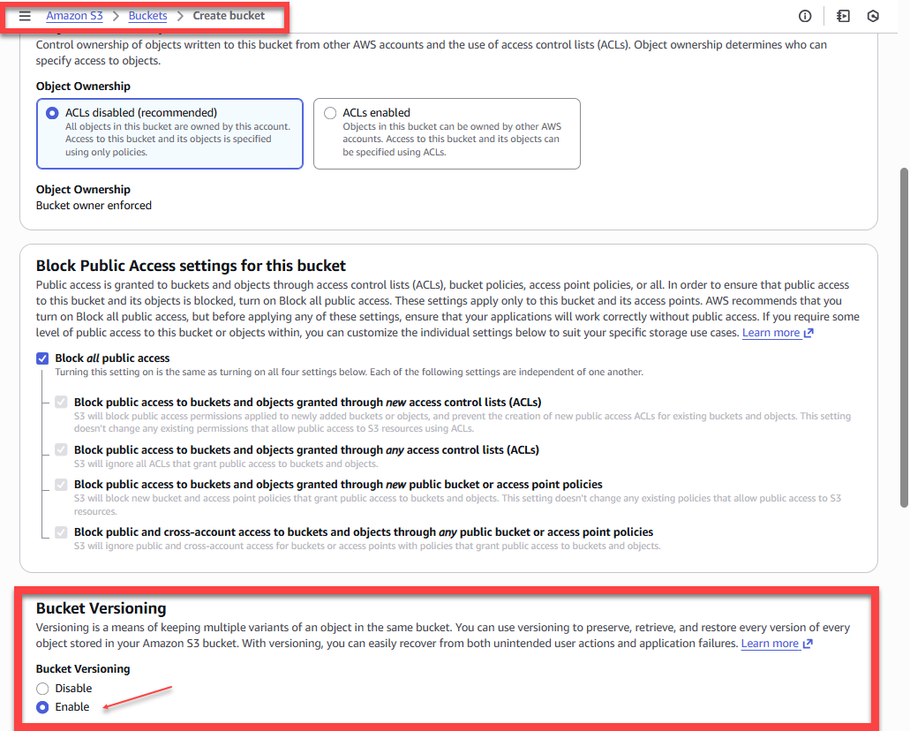

# Cross-Region S3 Bucket Replication (Hands-On Lab)

**Objective:**  
Set up Amazon S3 Cross-Region Replication (CRR) so that objects uploaded to a **source bucket** in Region A are automatically replicated to a **destination bucket** in Region B for resilience, durability, and availability during regional failures.

---

## 🧠 Why This Matters (Short Context)

Cross-Region Replication supports:

- **Disaster recovery** and business continuity
- **Compliance** for geo-redundant storage
- **Data locality** and latency improvements
- **Durability and protection** if a region experiences outage

Industries that rely on CRR include financial services, healthcare, media, and government due to stricter continuity and audit requirements.

---

## 🏗 Environment

- AWS Management Console
- Two AWS Regions (Region A → Region B)
- No CLI or IaC in this lab (console-based)

---

## 📦 Prerequisites and Core Requirements

For CRR to function correctly:

> **Versioning must be enabled on both the source and destination buckets.**

Versioning enables S3 to replicate:
- new object versions
- overwrites
- delete markers
- lifecycle transitions

Without versioning, replication cannot track lineage or state change.

---

## 📝 Lab Walkthrough — Step by Step

### **Step 1 — Create the Source S3 Bucket**

1. Navigate to **Amazon S3** in the AWS Console
2. Click **Create bucket**
3. Specify a unique bucket name and choose **Region A**
4. Leave Block Public Access enabled (default)
5. In **Bucket Versioning**, select:  
   `Enable` → **Required for replication**
6. Accept defaults and create the bucket

> 💡 **Observation:** AWS strongly recommends `Block Public Access` for new buckets for security.

---

### **Step 2 — Upload a File to the Source Bucket**

1. Open the newly created bucket
2. Select **Upload**
3. Upload any test file (image, text, etc.)
4. Confirm the upload succeeded

This object will later be used to verify replication behavior.

---

### **Step 3 — Create the Destination S3 Bucket**

1. Switch to a different AWS Region (**Region B**)
2. Click **Create bucket**
3. Provide a unique bucket name
4. Enable **Bucket Versioning**
5. Accept defaults and create the bucket

> ⚠️ **Both buckets must have versioning enabled for CRR to work.**

---

### **Step 4 — Create Replication Rule on the Source Bucket**

1. Return to the **source bucket**
2. Go to **Management → Replication rules**
3. Click **Create replication rule**
4. Name the rule (ex: `replicate-to-west`)
5. Choose the desired scope (default: replicate all objects)
6. Under **Destination**, select the destination bucket in Region B
7. AWS prompts to create an **IAM replication role**

#### 🔑 IAM Role (Behind the Scenes)

AWS automatically generates a role that allows S3 to:

- **Read source objects**
- **Write replicated objects to destination**
- **Manage object version lineage**

This reflects a key AWS principle:  
> Replication is not magical — it is IAM + API operations.

---

### **Step 5 — (Optional) Configure Replication Storage Class**

During the destination configuration, AWS allows you to select a different **storage class**. Options include:

- Standard
- Standard-IA
- Glacier Instant Retrieval
- Glacier Flexible Retrieval
- Glacier Deep Archive
- Intelligent-Tiering
- One Zone-IA

> **Interesting note:**  
> Replication rules can down-tier data for cost optimization or archival compliance.  
> Although this lab left defaults at `Standard`, it’s useful to know this exists for real workloads.

Example use cases:
- Compliance logs → Glacier Deep Archive
- Media → Standard-IA in cheaper region

---

### **Step 6 — Enable Support for Delete Markers (Important)**

CRR can optionally replicate:
- **delete markers**
- **delete operations**
- **overwrite versions**

Delete markers allow “soft delete” semantics to propagate across regions.

Example:
> If an object is deleted in Region A, the deletion marker can appear in Region B to maintain data consistency.

---

### **Step 7 — Save Rule & Trigger Replication**

1. Review summary
2. Confirm IAM role creation
3. Save rule

Replication begins for **future uploads** (not retroactive unless a batch operation is initiated).

---

### **Step 8 — Confirm Replication**

1. Upload a new file to the source bucket
2. Navigate to the destination bucket in Region B
3. Verify the replicated object appears
4. Confirm versioning is enabled and versions are tracked

Replication is **asynchronous**, so there may be slight delay before the object appears.

---

## 🧩 Behavior & Characteristics Learned

| Behavior | Meaning |
|---|---|
| **Not retroactive** | Only new objects replicate unless batch job initiated |
| **Asynchronous** | Replication is eventual, not instantaneous |
| **Uni-directional** | Replication flows one way unless explicitly configured both ways |
| **Version-aware** | Handles object updates + overwrites |
| **IAM enforced** | Requires managed role + policies |

---

## 🧾 Cost Considerations (Real-World Insight)

CRR introduces:

- Cross-region data transfer fees
- PUT request fees
- Storage costs in second region
- Optional Glacier archival costs

Value is justified where **downtime = money**, e.g.:

- financial institutions
- healthcare systems
- streaming media
- critical SaaS platforms

---

## 📌 When a Cloud Engineer Would Recommend CRR

You would suggest CRR when a customer requires:

✔ **Disaster Recovery (DR)**  
✔ **Business Continuity**  
✔ **Geo-redundancy**  
✔ **Compliance / Auditability**  
✔ **Low-latency for multi-region users**  

---

## 🎓 Would a Junior Cloud Engineer Be Expected to Know This?

Yes, at a conceptual level:

A junior engineer should know:

- what CRR is,
- what problems it solves,
- versioning requirement,
- IAM dependency,
- storage class implications

They are **not** expected to memorize console steps, but they should be able to:

> identify when it is appropriate to recommend CRR

---

## Final Reflection

This lab simulated a light version of what real teams do to harden storage against regional failures. The implementation was simple, but the capability is foundational to AWS resilience and compliance architectures.

