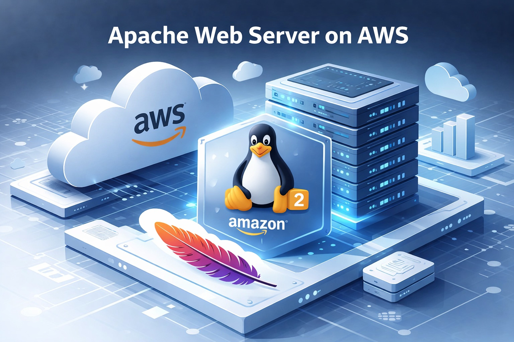

# Why Amazon Linux 2 Still Matters  
## Deploying an Apache Web Server on AWS

---

## Overview

As business continues to grow for L.U. Corp, a mid-sized technology company, the need for a reliable and scalable web presence becomes increasingly important. To support this growth, the organization has chosen to deploy an Apache Web Server on AWS using Amazon Linux 2.

Apache is a free, open-source web server software that delivers website content over the internet and remains one of the most widely used web servers in production environments today. Financial institutions and other highly regulated industries rely on Apache for its stability, flexibility, and long-term support.

This project walks through the foundational steps required to deploy an Apache web server in a cloud environment, while highlighting why Amazon Linux 2 and Apache continue to be relevant in real-world production systems.

---

## Architecture & Tools

- AWS EC2
- Amazon Linux 2
- Apache HTTP Server (httpd)
- AWS Security Groups
- SSH

---

## Implementation Steps

### Step 0: Project Overview


---

### Step 1: Connect to the EC2 Instance via SSH
An SSH connection is established to securely access the Amazon Linux 2 EC2 instance.


---

### Step 2: Update System Packages
Before installing any services, system packages are updated to ensure the instance has the latest patches and dependencies.

```bash
sudo yum update -y

---

### Step 3: Install Apache Web Server

Apache is installed using the Amazon Linux package manager.
sudo yum install httpd -y
