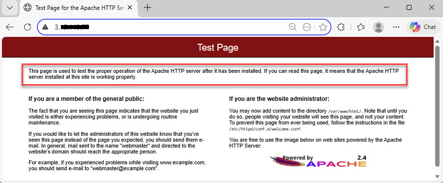

# Why Amazon Linux 2 Still Matters  
## Deploying an Apache Web Server on AWS

---

## Overview

As business continues to grow for L.U. Corp, a mid-sized technology company, the need for a reliable and scalable web presence becomes increasingly important. To support this growth, the organization has chosen to deploy an Apache Web Server on AWS using Amazon Linux 2.

Apache is a free, open-source web server software that delivers website content over the internet and remains one of the most widely used web servers in production environments today. Financial institutions and other highly regulated industries rely on Apache for its stability, flexibility, and long-term support.

This project walks through the foundational steps required to deploy an Apache web server in a cloud environment, while highlighting why Amazon Linux 2 and Apache continue to be relevant in real-world production systems.

---

## Architecture & Tools

- AWS EC2
- Amazon Linux 2
- Apache HTTP Server (httpd)
- AWS Security Groups
- SSH

---

### Step 1: Connect to the EC2 Instance via SSH
An SSH connection is established to securely access the Amazon Linux 2 EC2 instance.

---

### Step 2: Update System Packages
Before installing any services, system packages are updated to ensure the instance has the latest patches and dependencies.

sudo yum update -y

---

### Step 3: Install Apache Web Server

Apache is installed using the Amazon Linux package manager.

sudo yum install httpd -y

---

### Step 4: Start and Enable Apache
The Apache service is started and enabled to ensure it runs automatically on system reboot.

sudo systemctl start httpd

sudo systemctl enable httpd

---

### Step 5: Verify Apache is Running
The status of the Apache service is checked to confirm it is active and running.

sudo systemctl status httpd

---

###Step 6: Allow HTTP Traffic in the Security Group
Inbound rules are updated to allow HTTP traffic on port 80 so the web server can be accessed publicly.

---

### Step 7: Verify the Web Server in a Browser
Navigating to the instance’s public IP address displays the Apache default test page, confirming the server is installed correctly and accessible over the internet.

---

### Step 8: Replace the Apache Test Page with a Custom index.html
A custom index.html file is created in the Apache document root to replace the default test page and confirm control over the served content.

sudo nano /var/www/html/index.html

'''bash
<!DOCTYPE html>
<html>
<head>
    <title>Welcome</title>
</head>
<body>
    <h1>Welcome to LU Holdings!</h1>
    
This Apache web server is running on Amazon Linux 2.

</body>
</html>

---

### Outcome

The Apache web server was successfully deployed on an Amazon Linux 2 EC2 instance and verified through the instance’s public IP address. The Apache test page confirmed that the service was installed correctly, running, and accessible over the internet.

After creating a custom index.html file, the default test page was replaced with personalized content. This confirmed that the server could properly serve web files from its document root and that updates made on the server were reflected in the browser.

---

### Troubleshooting Scenario: Reviewing Apache Logs

In a real-world scenario, users may report that a website is not loading as expected. When this occurs, one of the first troubleshooting steps is reviewing Apache logs.

Apache maintains two primary log files:

Access logs record incoming requests to the server

Error logs capture issues encountered while processing those requests

Recent log entries were reviewed and redirected into separate files for easier analysis and record-keeping.

sudo tail -n 15 /var/log/httpd/access_log | sudo tee /var/log/httpd/AccessLogs_$(date +%F).txt > /dev/null
sudo tail -n 15 /var/log/httpd/error_log  | sudo tee /var/log/httpd/ErrorLogs_$(date +%F).txt  > /dev/null

This process demonstrates how logs are commonly reviewed during troubleshooting in production environments.

---

### Key Takeaways

Reinforced foundational Linux skills such as updating packages, managing services, and editing files

Gained hands-on experience configuring AWS security groups for public-facing services

Learned how Apache logs support troubleshooting and operational visibility

Demonstrated how open-source tools like Apache help reduce infrastructure costs

Highlighted how small EC2 instances can be used efficiently for lightweight workloads

---

### Final Thoughts

This project provides a practical introduction to deploying and validating a web server in the cloud using widely adopted technologies. While the steps are foundational, they reflect real tasks that are still commonly performed in production environments.

Incorporating a troubleshooting scenario reinforced the importance of understanding not only how to deploy infrastructure, but also how to support it when issues arise. This exercise helped build confidence with Linux, AWS, and basic operational workflows, while emphasizing the value of intentional and cost-aware cloud design.

